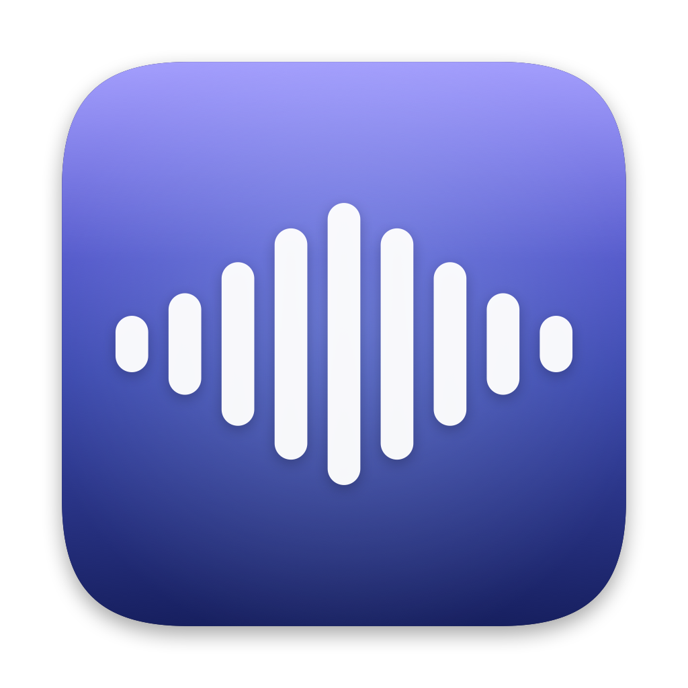
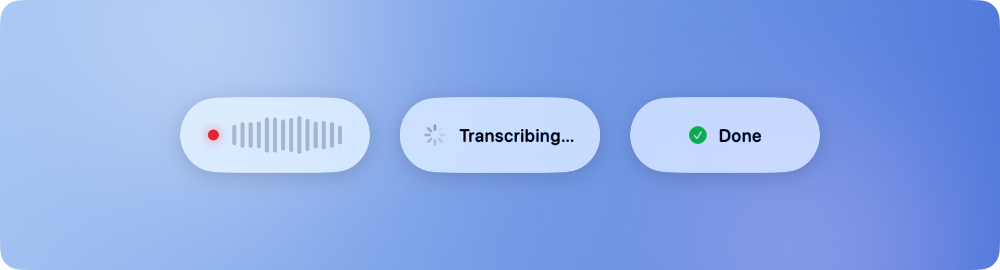
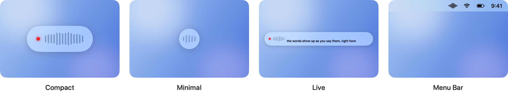

<p align="center">
  
</p>

<h1 align="center">SpeakUp</h1>

<p align="center">
  <strong>Talk to your agents.</strong><br>
  Push-to-talk dictation for macOS. Hold a key, say the prompt, let go.<br>
  It is in Claude Code, Codex, Cursor or OpenCode before you can reach for the Enter key.
</p>

<p align="center">
  <a href="INSTALL.md"></a>
  <a href="INSTALL.md"></a>
  <a href="LICENSE"></a>
  <a href="https://github.com/dinooo13/speakup/actions/workflows/ci.yml"></a>
</p>

<p align="center">
  <a href="INSTALL.md">Install</a> ·
  <a href="#why-speakup">Why</a> ·
  <a href="#built-for-agents">Agents</a> ·
  <a href="#speed">Speed</a> ·
  <a href="#private-by-construction">Privacy</a> ·
  <a href="#choose-your-style">Styles</a> ·
  <a href="#faq">FAQ</a>
</p>

<!--
  Hero GIF goes here: six to eight seconds of holding Right Command, saying a
  prompt into Claude Code, letting go, the text landing, the agent starting.
  Record with QuickTime or `screencapture -v`, convert with ffmpeg + gifski.
  Replace the picture below with:
  <p align="center"></p>
-->

<p align="center">
  <picture>
    <source media="(prefers-color-scheme: dark)" srcset="docs/images/flow-dark.png">
    
  </picture>
</p>

<p align="center"><em>Hold. Release. Pasted.</em></p>

---

## Why SpeakUp

You type long prompts all day. Speech is three to four times faster than typing, and the thing that has always made dictation annoying is waiting for it. SpeakUp is built around one number: the time between letting go of the key and the text appearing. On the slowest supported Mac, a ten second sentence transcribes in about a quarter of a second.

- **One key, everywhere.** Hold Right Command, or any key or chord you record. Speak. Release. The words land at the cursor in any app that takes text. No window to open, no button to click, no mode to leave.
- **Nothing leaves your Mac.** The speech model runs on the Neural Engine. There is no account, no server, no telemetry, and the app makes no network requests after the one-time model download.
- **It knows your words.** A dictionary turns what the model hears into what you meant. "clode code" becomes "Claude Code", "get hub" becomes "GitHub", every time, at zero cost in latency.
- **It behaves like part of macOS.** A menu bar app with a Liquid Glass status pill, a standard settings window, and nothing in the Dock.
- **Twenty-five languages, switched automatically.** English, German, Spanish, French and the rest of Europe in the same session, with no setting to flip.
- **Free and MIT.** The source is here. Read it, build it, change it.

## Built for agents

SpeakUp pastes into whatever has focus, so it works with every editor and terminal. It was made for the loop where you talk to an agent, it works, and you talk again:

- **Claude Code**, **Codex** and **OpenCode** in the terminal. Hold the key, describe the change, release. The prompt is in the input line and you press Enter.
- **Cursor** and any other editor. Dictate into chat, into a comment, into a commit message.
- **Anything else with a text field.** Slack, Mail, a browser, a form.

Two things make dictation into a terminal work where general dictation apps stumble. The latency is short enough that you stay in the conversation instead of waiting for it. And the dictionary fixes the names that speech models get wrong: product names, libraries, commands, your own project's jargon.

## Speed

The time from letting go of the key to the text appearing is the whole product, and it is measured before and after every change that touches it. Engine times on an Apple M1, the least powerful chip SpeakUp supports:

| Speech | Engine time | Realtime factor |
|---|---:|---:|
| 10 s | 0.24 s | 41× |
| 30 s | 0.40 s | 80× |
| 60 s | 0.56 s | 108× |
| 2 min | 0.91 s | 138× |

The engine is NVIDIA's Parakeet TDT v3, running on the Neural Engine through [FluidAudio](https://github.com/FluidInference/FluidAudio). It stays loaded, so the first dictation after launch is as quick as the hundredth. Procedure and baseline are in [docs/BENCHMARKS.md](docs/BENCHMARKS.md).

## Private by construction

Privacy here is not a policy, it is how the thing is built.

- **Audio never leaves the Mac.** The microphone is open only while the key is held, and macOS shows the orange indicator only then. Audio goes from the microphone to the Neural Engine and is discarded.
- **Text never leaves the Mac.** The transcript exists long enough to be pasted. Your previous clipboard is put back afterwards.
- **No network.** The only request SpeakUp ever makes is the one-time download of the speech model from Hugging Face, about 700 MB, on first launch. After that it works with Wi-Fi off. There is no update check, no crash reporter, no analytics.
- **No account.** Nothing to sign up for, nothing to log in to, nothing to cancel.
- **Auditable.** The app is about five thousand lines of Swift under the MIT license, and none of them open a network connection. The model download is FluidAudio's, and it runs once.

## Choose your style

A small pill at the bottom of the screen tells you what is happening: a red dot and a live level meter while you speak, a spinner while it thinks, a tick when the text is in. It never takes focus from the app you are typing into. Show as much or as little of it as you like.

<p align="center">
  <picture>
    <source media="(prefers-color-scheme: dark)" srcset="docs/images/styles-dark.png">
    
  </picture>
</p>

- **Compact.** The full pill with the level meter. You always know it is listening.
- **Minimal.** A small disc with a pulse. Enough to see it is on, not enough to look at.
- **Menu Bar.** Nothing on the desktop at all. The wave in the menu bar is the only sign.

Each comes in Liquid Glass or a flat fill, in light, dark or whatever the system is doing. Pick a different push-to-talk key by pressing it. Teach it your words in the dictionary, and share the rules with your team as a JSON file.

## Install

macOS 26 or later on Apple Silicon. Build from source in about a minute:

```sh
git clone https://github.com/dinooo13/speakup.git
cd speakup
./scripts/bundle.sh --install --run
```

Grant Microphone and Accessibility when asked, wait for the model to download once, then hold **Right Command** in any text field and speak. The full walkthrough, signing, troubleshooting and the command-line tool are in [INSTALL.md](INSTALL.md).

## FAQ

**Does SpeakUp work with Claude Code?**
Yes. Hold the key while the terminal has focus, speak, release. The text is pasted into the prompt. The same goes for Codex, OpenCode, Cursor and any other terminal or editor.

**Does my audio leave my Mac?**
No. Transcription runs on the Neural Engine. SpeakUp makes no network requests after the one-time model download and has no account or telemetry.

**Is SpeakUp free?**
Yes. MIT license, no tiers, no trial.

**How is it different from Wispr Flow, Superwhisper or macOS dictation?**
SpeakUp does one thing: push-to-talk, on-device, into any app, as fast as the hardware allows. There is no cloud path, no subscription and no account. It is open source, and the speed is benchmarked in the repository rather than claimed.

**Which languages?**
The 25 European languages Parakeet TDT v3 supports, including English, German, French, Spanish, Italian, Portuguese, Dutch, Polish and Ukrainian. It detects the language as you speak.

**Which Macs?**
Any Apple Silicon Mac on macOS 26 or later. Benchmarks are taken on an M1, so every newer chip is faster.

**Can I change the key?**
Yes. Any key or combination, recorded by pressing it in Settings. Right Command is the default because nothing else uses it.

**What about long dictations?**
Recordings stop at 120 seconds, so a lost key-up never leaves the microphone on. Audio longer than 15 seconds is transcribed in overlapping windows.

## Contributing

Issues and pull requests are welcome. The [CLAUDE.md](CLAUDE.md) file states what the project optimises for and the rule that every change on the release-to-paste path ships with a benchmark. [docs/BENCHMARKS.md](docs/BENCHMARKS.md) has the procedure.

## License

MIT. See [LICENSE](LICENSE).

Parakeet TDT is by NVIDIA (CC-BY-4.0). FluidAudio is by FluidInference (Apache-2.0).
