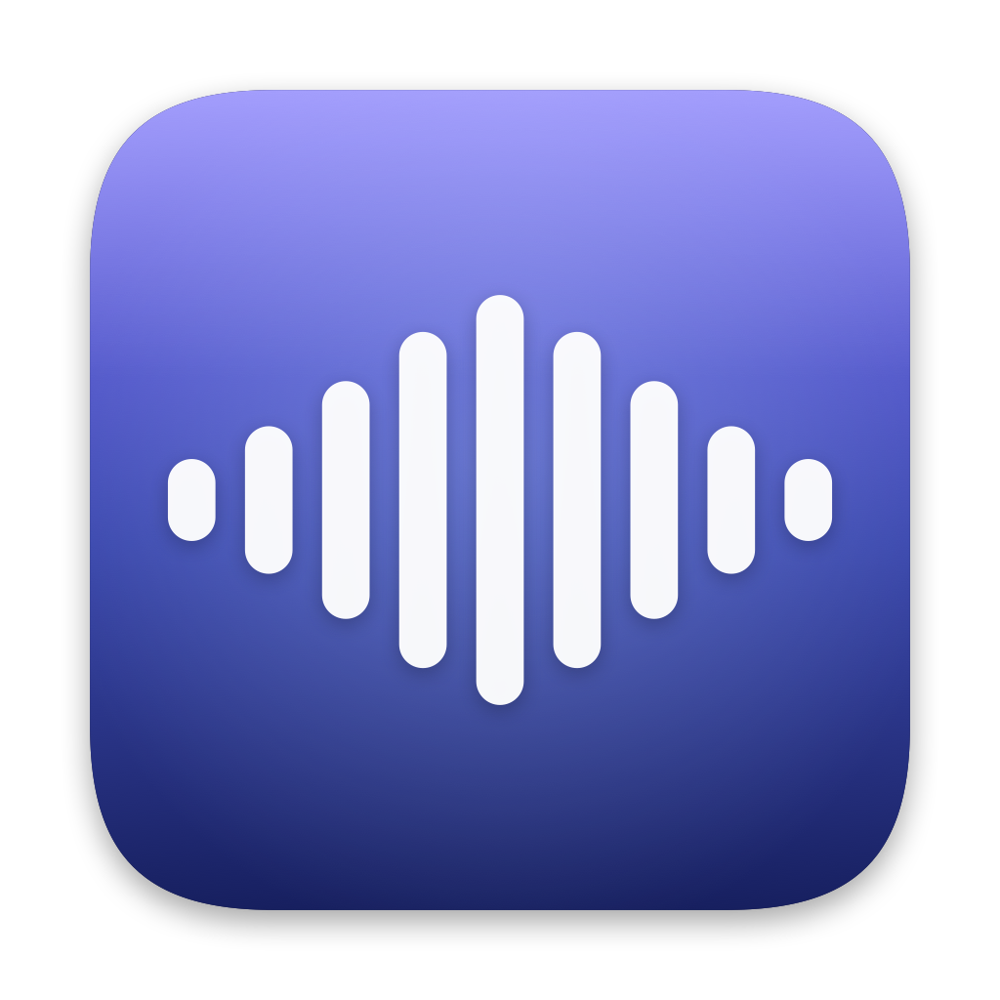
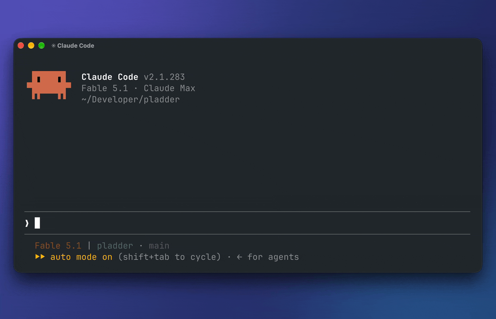

<p align="center">
  
</p>

<h1 align="center">Pladder</h1>

<p align="center">
  <strong>Talk to your agents.</strong><br>
  Push-to-talk dictation for macOS. Hold a key, say the prompt, let go.<br>
  It's already in Claude Code, Codex, Cursor or OpenCode before you can reach for the Enter key.<br>
  <br>
  Insanely fast · 100% private · No data leaves your Mac
</p>

<p align="center">
  <a href="INSTALL.md"></a>
  <a href="INSTALL.md"></a>
  <a href="LICENSE"></a>
  <a href="https://github.com/dinooo13/pladder/actions/workflows/ci.yml"></a>
</p>

<p align="center">
  <a href="#install">Install</a> ·
  <a href="#speed">Speed</a> ·
  <a href="#private-by-construction">Privacy</a> ·
  <a href="#built-for-agents">Agents</a> ·
  <a href="docs/USAGE.md">Usage</a> ·
  <a href="#faq">FAQ</a>
</p>

<p align="center">
  
</p>

<p align="center"><em>Hold. Release. Pasted.</em></p>

---

You type long prompts all day. Speech is three to four times faster than typing, and the thing that has always made dictation annoying is waiting for it. Pladder is built around one number: the time between letting go of the key and the text appearing.

## Speed

**About 300 ms from letting go to pasted text, on an M1, the slowest chip Pladder runs on.** It does not matter whether you spoke for five seconds or five minutes: the recording is transcribed while you are still speaking, so by the time you release the key there is almost nothing left to do.

The engine is NVIDIA's Parakeet TDT v3, running on the Neural Engine through [FluidAudio](https://github.com/FluidInference/FluidAudio). It loads at launch and stays loaded, so the first dictation after launch is as quick as the hundredth. Why it is fast is written up in [docs/PERFORMANCE.md](docs/PERFORMANCE.md); the measurement procedure and the full baseline are in [docs/BENCHMARKS.md](docs/BENCHMARKS.md).

## Private by construction

Audio and text never leave the Mac. The microphone is open only while you hold the key, the transcript exists long enough to be pasted, and your clipboard is put back afterwards. There is no account, no telemetry and no update check. The only requests Pladder ever makes are one-time model downloads from Hugging Face: the speech model on first launch, and S1-mini by Superwhisper only if you pick it for polish. After that it works with Wi-Fi off. What Pladder does with your words, step by step, is in [docs/PRIVACY.md](docs/PRIVACY.md).

## Built for agents

Pladder pastes into whatever has focus, so it works in every terminal and editor: Claude Code, Codex and OpenCode, Cursor, and anything else with a text field. It was made for the loop where you talk to an agent, it works, and you talk again. Hold Option+Space, describe the change, tap V with the same hand, and let go: the prompt is pasted, Return is pressed, and the agent is running while your other hand never left the mouse.

A dictionary fixes the words speech models get wrong: product names, libraries, commands, your project's jargon. "clode code" becomes "Claude Code", every time, at no cost in latency.

## Install

There is no download yet; Pladder builds from source in about a minute. It needs macOS 26 or later on Apple Silicon, and Xcode 26 to build:

```sh
git clone https://github.com/dinooo13/pladder.git
cd pladder
./scripts/bundle.sh --install --run
```

Grant Microphone and Accessibility when asked, wait for the speech model to download once, then hold **Option+Space** in any text field and speak. Signing, updating, troubleshooting and the command-line tool are in [INSTALL.md](INSTALL.md).

## What else it does

- **Your keys.** Record any push-to-talk key or send key by pressing it, or add a toggle key for long dictations. Escape discards a recording.
- **It learns your words.** Correct a word by hand after a dictation and Pladder offers to add it to the dictionary, checked on device and added only when you say so.
- **It skips over the ums.** "Uh", "um", "äh" and "eh" are dropped, and spoken punctuation such as "comma" or "new paragraph" becomes the mark.
- **Polish, if you like.** An experimental on-device model turns "wait, no, Friday" into "Friday" before the paste.
- **Twenty-five languages,** detected as you speak, with no setting to flip.
- **Part of macOS.** A menu bar app with a Liquid Glass pill in four styles, and nothing in the Dock.
- **Free and MIT.** The source is here. Read it, build it, change it.

All of it is described in [docs/USAGE.md](docs/USAGE.md).

## FAQ

**How is it different from Wispr Flow, Superwhisper or macOS dictation?**
Pladder does one thing: push-to-talk, on-device, into any app, as fast as the hardware allows. There is no cloud path, no subscription and no account. It is open source, and the speed is benchmarked in the repository rather than claimed.

**Which Macs?**
Any Apple Silicon Mac on macOS 26 or later. Benchmarks are taken on an M1, so every newer chip is faster.

**Which languages?**
The 25 European languages Parakeet TDT v3 supports, including English, German, French, Spanish, Italian, Portuguese, Dutch, Polish and Ukrainian.

**Option+Space is my Alfred or Raycast hotkey, or I type non-breaking spaces with it.**
Both are lost while Pladder runs. Record another combination in Settings; see [push to talk](docs/USAGE.md#push-to-talk).

**Can another program use it for speech-to-text?**
Yes. `pladder-cli` transcribes an audio file and prints only the text. [docs/HERMES.md](docs/HERMES.md) sets it up for Hermes Agent's voice messages.

## Contributing

Issues and pull requests are welcome. The [CLAUDE.md](CLAUDE.md) file states what the project optimises for and the rule that every change on the release-to-paste path ships with a benchmark. [docs/BENCHMARKS.md](docs/BENCHMARKS.md) has the procedure.

## The name

*Pladder* is Low German (*Plattdeutsch*) for "to babble". You just pladder into the microphone and the text gets pasted.

## License

MIT. See [LICENSE](LICENSE).

Parakeet TDT is by NVIDIA (CC-BY-4.0). FluidAudio is by FluidInference (Apache-2.0).
