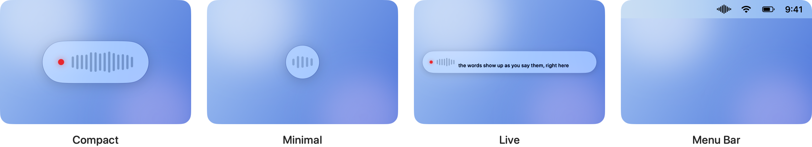

# Using Pladder

What Pladder does and how to change it. Installing it is in [INSTALL.md](../INSTALL.md).

- [Keys](#keys)
- [Your words](#your-words)
- [Cleaning up the text](#cleaning-up-the-text)
- [The pill](#the-pill)
- [While you dictate](#while-you-dictate)
- [Languages](#languages)
- [Long dictations](#long-dictations)
- [From the command line](#from-the-command-line)

## Keys

### Push to talk

Hold Option+Space, either Option, speak, and let go. The words land at the cursor in any app that takes text. No window to open, no button to click, no mode to leave.

Any key or combination can take its place: record it in Settings by pressing it. Option+Space is the default because no macOS shortcut owns it and it works without Accessibility. It is also Alfred's default hotkey and a common Raycast choice, and it types a non-breaking space in most layouts; all three are lost while Pladder runs, so record another combination if you need them.

### Send

Press the send key, Right Option by default, at any point while you hold the push-to-talk key, and Return is pressed after the text is pasted. That sends a chat message, a prompt to an agent or a terminal command without touching the keyboard again. The send key can be changed in Settings, like the push-to-talk key.

### Toggle

For a long dictation, record a toggle key in Settings: one tap starts a recording, the next tap inserts it. Give it the same combination as the push-to-talk key and that key does both: tap to start and tap again to insert, or hold and release as before. It is off by default, because a stray tap would otherwise leave the microphone open.

### Escape

Escape discards a recording without transcribing, held or toggled. It is taken only while a recording is on, so the rest of the time it keeps closing dialogs.

### Without Accessibility

On an account that cannot grant Accessibility, Pladder still works in a reduced form: Option+Space behaves the same, any combination with a regular key can be recorded, and the transcript is left on the clipboard for you to paste with ⌘V. [INSTALL.md](../INSTALL.md#first-launch) explains the grant.

## Your words

### The dictionary

A dictionary turns what the model hears into what you meant. "clode code" becomes "Claude Code", "get hub" becomes "GitHub", every time, at no cost in latency. List a word on its own and near misses of it are repaired too, so "Chat G P T" comes out as "ChatGPT" without you predicting every way the model might mangle it. Share the rules with your team as a JSON file.

### Learned corrections

Correct a word by hand after a dictation and Pladder offers to remember it: a line in the menu reads "Learned “x” → “y”? Add / Dismiss". Nothing is added until you say so. The pair is checked on device first, so only a plausible mishearing is offered, and a change of case never is. This needs Accessibility and Apple Intelligence. Terminals show a screen rather than a text field, so nothing is learned there. What Pladder reads to notice a correction is in [PRIVACY.md](PRIVACY.md).

## Cleaning up the text

### Fillers

Hesitation sounds — "uh", "um", German "äh"/"ähm", Spanish "eh" — are dropped before the text is pasted, at no cost in latency. Only English, German and Spanish fillers are covered for now; other languages pass through unchanged.

### Spoken punctuation

Say "comma" and get one. "Question mark", "new paragraph", German "Fragezeichen" and Spanish "signo de interrogación" become the mark itself, again at no cost in latency. Only phrases that are never ordinary words are taken, so "period" and "Punkt" stay words.

### Polish

Turn on **Polish dictations** in Settings, Processing, and a small model cleans the transcript on your Mac before it is pasted: "wait, no, Friday" becomes "Friday", "first… second…" becomes a list. It is experimental and off by default, because it sits between letting go and the paste. Transcripts under four words are pasted as they are, and anything a model cannot fix is pasted as dictated.

Pick the model below the toggle:

- **Apple Intelligence** needs nothing downloaded but takes a second or two, and Apple Intelligence has to be turned on in System Settings.
- **S1-mini by Superwhisper** is downloaded once from Hugging Face (1.5 GB, or 805 MB at 8-bit) and takes about half a second. It is trained on English and also handles German and Spanish.

How the models compare is in [BENCHMARKS.md](BENCHMARKS.md).

## The pill

A small pill at the bottom of the screen shows a red dot and a live level meter while you speak, and is gone the moment you let go; the pasted text is the confirmation. Only when transcription takes longer than usual — the first dictation after launch, say — does a spinner say so. It never takes focus from the app you are typing into. Show as much or as little of it as you like.

  <picture>
    <source media="(prefers-color-scheme: dark)" srcset="images/styles-dark.png">
    
  </picture>

- **Compact.** The full pill with the level meter. You always know it is listening.
- **Minimal.** A small disc with a pulse. Enough to see it is on, not enough to look at.
- **Live.** The words as they are recognised, while you are still speaking. The wider pill costs a little more of the chip than the others; the text it shows is only a preview, and what gets pasted is always the full recording.
- **Menu Bar.** Nothing on the desktop at all. The wave in the menu bar is the only sign.

Each comes in Liquid Glass or a flat fill, in light, dark or whatever the system is doing.

## While you dictate

Turn on **Mute audio while dictating** in Settings and music or a call is muted while you speak, so it does not end up in the microphone. It starts 200 ms into a recording, so a quick tap never touches the sound, and it leaves a device you had muted yourself alone. It is off by default.

## Languages

The 25 European languages Parakeet TDT v3 supports, including English, German, French, Spanish, Italian, Portuguese, Dutch, Polish and Ukrainian. The language is detected as you speak, so English, German and the rest of Europe mix in the same session with no setting to flip. Filler removal and spoken punctuation cover English, German and Spanish.

## Long dictations

Recordings stop at 10 minutes, so a lost key-up never leaves the microphone on; what was said up to then is pasted. Audio longer than 15 seconds is transcribed in overlapping windows while you are still speaking, so the wait after letting go stays the same.

## From the command line

`pladder-cli` transcribes an audio file and prints only the text, so anything that runs a command for speech-to-text can use it; `--process` runs the same clean-up as the app. How to run it is in [INSTALL.md](../INSTALL.md), and [HERMES.md](HERMES.md) sets it up for Hermes Agent's voice messages.
